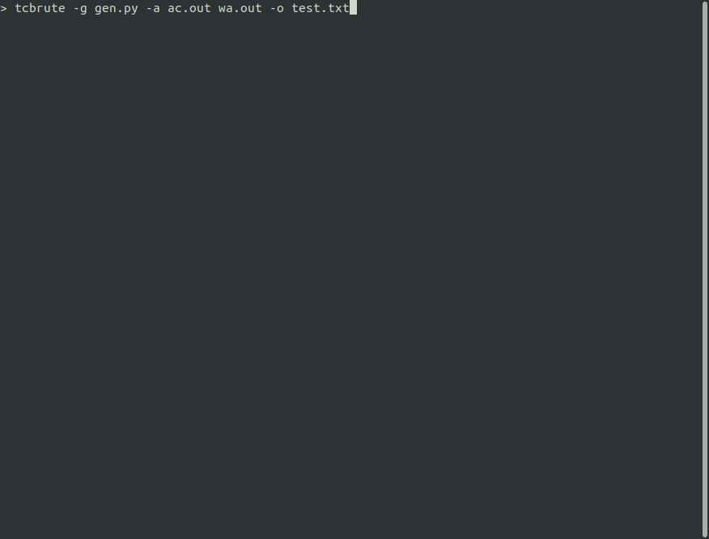
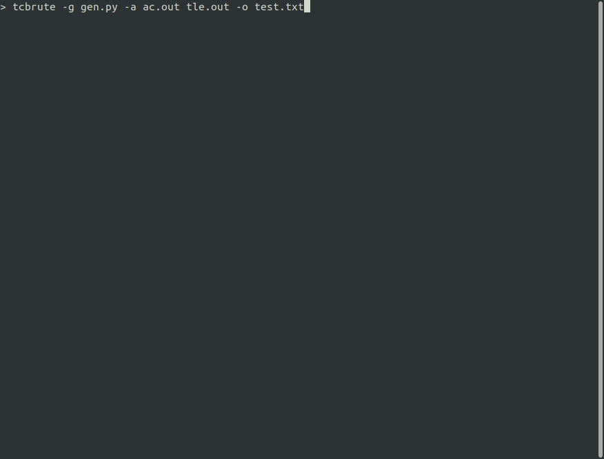
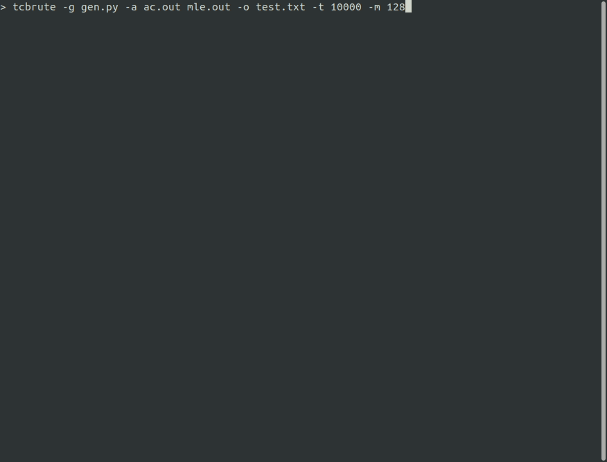

# TCBRUTE (TestcaseBruteforces)
Do bruteforce to find a test case that make my algorithm fail.

The GIF below is an example to find a WA testcase with three files: [testcase generator](./samples/0.%20General/gen.py), [WA algorithm](./samples/0.%20General/wa.cpp), [AC algorithm](./samples/0.%20General/ac.cpp).

```sh
# example
tcbrute -g gen.py -a ac.out wa.out -o test.txt
```


## Options

```
tcbrute
  Do bruteforce to find a test case that make my algorithm fail.

Usage:
  tcbrute [options]

Options:
  -g, --generator <generator> (REQUIRED)    The testcase generator file path
  -a, --algorithms <algorithms> (REQUIRED)  The executables to find testcases that make them fail
  -o, --out-path <out-path>                 Path to save a testcase (if it is not specified, Program prints it on the terminal and exits.)
  -t, --time-limit <time-limit>             The time limit (ms) [default: 2000]
  -m, --memory-limit <memory-limit>         The memory limit (MB) [default: 512]
  --version                                 Show version information
  -?, -h, --help                            Show help and usage information
```

**Note that you can specify a generator or algorithms by commands.** For example, you can use syntax like below.

```
tcbrute -g "node generator.js" -a "go algo1.go" "python algo2.py" "pypy3 algo3.py"
```

## Install

To install `tcbrute` on your local, install [dotnet 5.0](https://dotnet.microsoft.com/download/dotnet/5.0), and execute `install.sh`. It will copy executables to `/usr/local/tcbrute` and make a symbolic link at `/usr/bin/tcbrute`.

```
sudo ./install.sh
```

After installation, you can use this program with `tcbrute`.

```
> tcbrute -h
  _____    ____   ____    ____    _   _   _____   _____                                                                                                                                                                         
 |_   _|  / ___| | __ )  |  _ \  | | | | |_   _| | ____|                                                                                                                                                                        
   | |   | |     |  _ \  | |_) | | | | |   | |   |  _|                                                                                                                                                                          
   | |   | |___  | |_) | |  _ <  | |_| |   | |   | |___                                                                                                                                                                         
   |_|    \____| |____/  |_| \_\  \___/    |_|   |_____|                                                                                                                                                                        
                                                                                                                                                                                                                                
tcbrute
  Do bruteforce to find a test case that make my algorithm fail.

Usage:
  tcbrute [options]

Options:
  -g, --generator <generator> (REQUIRED)    The testcase generator file path
  -a, --algorithms <algorithms> (REQUIRED)  The executables to find testcases that make them fail
  -o, --out-path <out-path>                 Path to save a testcase (if it is not specified, Program prints it on the terminal and exits.)
  -t, --time-limit <time-limit>             The time limit (ms) [default: 2000]
  -m, --memory-limit <memory-limit>         The memory limit (MB) [default: 512]
  --version                                 Show version information
  -?, -h, --help                            Show help and usage information
```

## Examples

To reproduce results below, build C++ files in `samples`.

### 1. Wrong Answer



### 2. Time Limit Exceeded



### 3. Runtime Error


### 4. Memory Limit Exceeded

